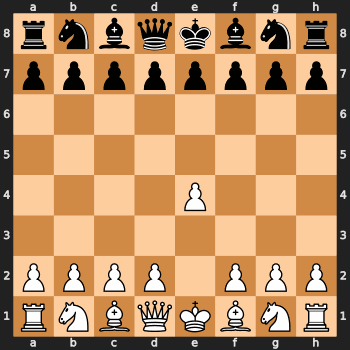

# Chess Game Animation

This project generates an **animated GIF** of a chess game from a **PGN** file.

## Features
- Parses PGN files to extract moves
- Generates board images for each move
- Creates an animated GIF showing the game's progression

## Installation

### Conda (Recommended)

Install dependencies and activate the environment

```sh
conda create -n chess-animation -c conda-forge cairo pango gdk-pixbuf ffmpeg python-chess pillow imageio cairosvg
conda activate chess-animation

Install chessanimate with Pip

```sh
git clone https://github.com/djstompzone/chessanimate ~/chessanimate
cd ~/chessanimate
pip install .
```

### Manual Installation with Pip

Install python dependencies

```sh
pip install python-chess pillow imageio cairosvg
```

Install `chessanimate`

```sh
git clone https://github.com/djstompzone/chessanimate ~/chessanimate
cd ~/chessanimate
pip install .
```

You'll also need to manually install system dependencies

```sh
# Debian/Ubuntu
sudo apt install libcairo2-dev libjpeg-dev libgif-dev

# macOS
brew install cairo
```

## Usage

Requires a **PGN** file (e.g., `game.pgn`)

### Basic Usage

```sh
python -m chessanimate game.pgn
```

The output will be saved as `chess_animation.gif`.

### Customization

To customize the frame duration

```sh
python -m chessanimate game.pgn -d 500
```

To specify the output filenane

```sh
python -m chessanimate game.pgn -o animation.gif
```

For a full list of arguments, you can view the help

```sh
python -m chessanimate --help
```

## Dependencies
- **python-chess** - Chess board rendering & PGN parsing
- **Pillow** - Image processing
- **imageio** - GIF creation
- **cairosvg** - Converts SVG to PNG
- **Cairo** - Required for SVG rendering

## Output Example



## License

MIT License.

## Credits

Author: [DJ Stomp](https://github.com/djstompzone)
Repo: [GitHub - chessanimate](https://github.com/djstompzone/chessanimate)
